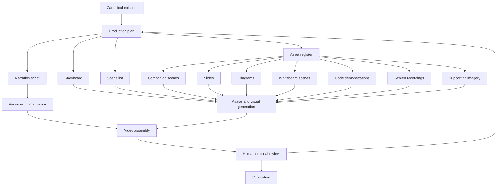

# Media Production System

The Articulate media production system turns a canonical written episode into reviewed, publishable media. It exists to make production repeatable without weakening the primacy of the written journal.

The system is intentionally staged. Some stages are deterministic, such as extracting source references or assembling approved metadata. Other stages are generative, such as proposing a storyboard, drafting narration, or creating visual material. Generative stages may accelerate production, but they do not become authoritative until reviewed.

## Conceptual Flow

```text
Canonical episode
      |
      v
Production plan
      |
      +--> Narration script
      +--> Storyboard
      +--> Scene list
      +--> Asset register
              |
              +--> Companion scenes
              +--> Slides
              +--> Diagrams
              +--> Whiteboard scenes
              +--> Code demonstrations
              +--> Screen recordings
              +--> Supporting imagery
      |
      v
Recorded human voice
      |
      v
Avatar and visual generation
      |
      v
Video assembly
      |
      v
Human editorial review
      |
      v
Publication
```



## Stage Responsibilities

### Canonical Episode

The canonical episode is the Markdown source under `docs/episodes/`. It contains the approved argument, sequence, claims and framing. Production work may summarise, sequence or adapt this material, but must not silently add unsupported claims.

Source management is handled through normal repository version control. Production artefacts should reference the episode path, heading names and, where useful, short source excerpts.

### Production Plan

The production plan defines the editorial treatment for a specific episode. It records the audience, intended outcome, target duration, narrative shape, companion usage, required visual material, risks, dependencies and review gates.

The plan is authored by a human with AI assistance. It is expected to evolve during production, but approved versions should be retained through Git history.

### Narration Script

The narration script adapts the episode into spoken form. It may omit detail, change order for listening clarity, or add brief transitions, but each important claim must remain traceable to the canonical episode or be labelled as an editorial addition.

The script is an authored production artefact. AI may draft or restructure it, but Russell's recorded voice is the authoritative performance.

### Storyboard

The storyboard describes how the episode becomes visual. It determines when the companion appears, when slides are useful, where diagrams or sketches clarify the argument, and where repository or website views provide evidence.

The storyboard is interpretive. It should exploit video as a medium rather than turn the essay into a continuous slide deck.

### Scene List

The scene list is the operational view of the storyboard. It identifies each scene, duration estimate, narration reference, visual type, companion mode, required assets, transition, status and review state.

The scene list should be structured enough for future tooling, but it remains a planning document rather than a binding implementation schema.

### Asset Register

The asset register records visual, audio and supporting assets. Each asset should include its source, generation method, ownership or licence, episode section, scene usage, version, status and review notes.

This register provides provenance and recovery information. If an asset must be regenerated, replaced or challenged later, the register should explain where it came from and why it was used.

### Recorded Human Voice

The production system uses Russell's recorded voice as the human authored narration. Voice recording is separate from narration drafting. The recording may include retakes, pauses and editorial choices that need to be reflected back into the script or scene timing.

### Avatar and Visual Generation

Avatar and visual generation creates derived visual material from approved production artefacts. This includes companion scenes, slides, diagrams, whiteboard moments, code demonstrations, screen recordings and supporting imagery.

This stage is generative and must be reviewed. The companion must be presented as an AI-created visual presenter, not as a digital clone or autonomous author.

### Video Assembly

Video assembly combines recorded voice, scenes, visual assets, subtitles, transcripts, title cards and publication metadata into a rough cut and final cut.

The assembly process should preserve editability. Project files, export settings and asset versions should be recorded so the episode can be revised or recovered.

### Human Editorial Review

Human review determines whether the derived media faithfully represents the episode, handles uncertainty honestly, meets accessibility expectations and is suitable for publication.

Review decisions should record what was approved, what changed and what remains unresolved.

### Publication

Publication includes platform-specific metadata, descriptions, captions, thumbnails, transcripts, links back to the canonical episode and any required disclosure about AI-assisted production.

Publication is a release event, not merely an upload. It should be traceable to the source episode version and approved production artefacts.

## Cross-Cutting Concerns

### Provenance and Traceability

Every important narration claim, diagram concept, companion scene and visual metaphor should trace back to a source section or be labelled as an editorial addition. Traceability protects the architectural argument from drift as it moves across media.

### Deterministic and Generative Boundaries

Deterministic activities include source reference extraction, checklist completion, metadata validation and assembly from approved assets. Generative activities include drafting narration, proposing visuals, creating images, producing companion motion and summarising sections. Generative outputs require review before use.

### Versioning

Textual production artefacts are versioned in Git. Generated assets should carry explicit versions in the asset register. Published outputs should record the canonical episode version, production artefact state and export date.

### Generated Asset Storage

Generated assets should not be treated as anonymous files. They need stable identifiers, source references, generation method, ownership or licence information, review state and replacement notes. Large binary artefacts may live outside the repository if their register entries remain sufficient.

### Reproducibility

Reproducibility means a future editor can understand how an output was created, not that every generative stage will produce bit-for-bit identical results. Prompts, source references, tool settings, asset versions and review decisions should be retained when they affect the final work.

### Accessibility

Every published video should plan for subtitles, transcripts, meaningful on-screen text, readable diagrams, sufficient contrast, clear pacing and alternatives for important visual-only information. Accessibility review is a production gate, not a final polish task.

### Subtitles and Transcripts

Subtitles and transcripts should derive from the approved narration and final edit. They need review because recorded delivery often differs from the written script. Transcripts should link back to the canonical episode where practical.

### Publication Metadata

Descriptions, titles, thumbnails, chapters, tags and links are part of the production system. They should be traceable to the episode and reviewed for accuracy, clarity and appropriate disclosure.

### Failure and Recovery

Production can fail through inaccurate generated claims, unusable visuals, broken source references, lost assets, inaccessible edits, poor audio, or review rejection. Recovery depends on clear stage boundaries: return to the production plan for editorial failures, the asset register for missing or rejected assets, and the scene list for timing or assembly problems.

### Future Automation

Future automation may generate first-pass plans, extract source references, validate YAML, check traceability, prepare subtitles, assemble metadata or create draft scene lists. Automation should support editorial judgement rather than replace it.
